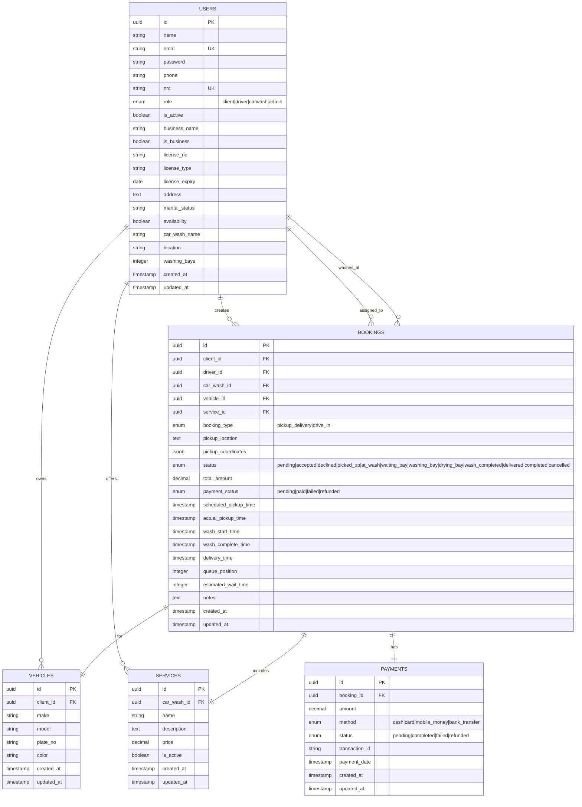
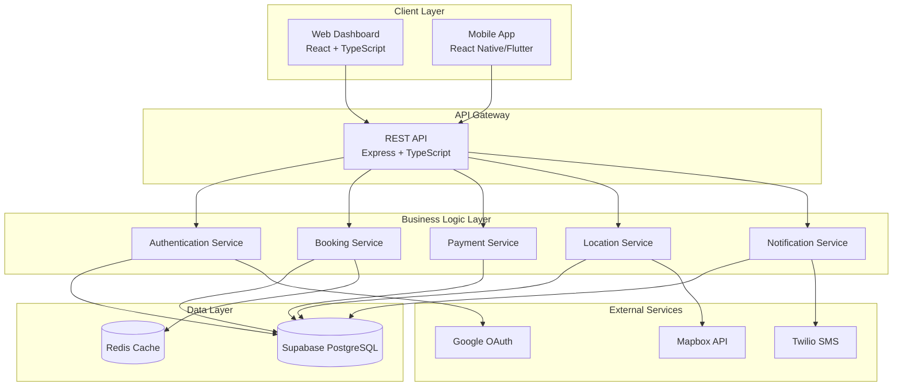
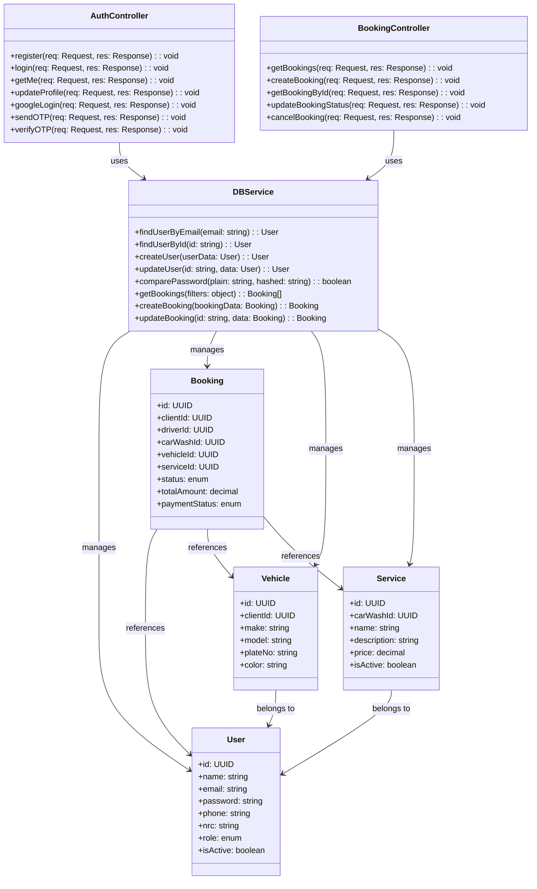
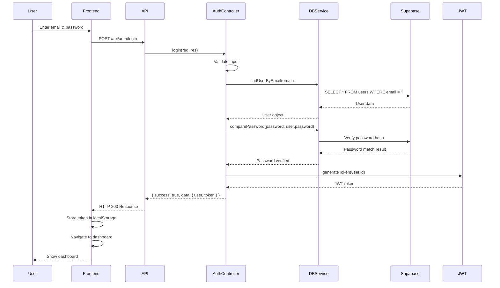
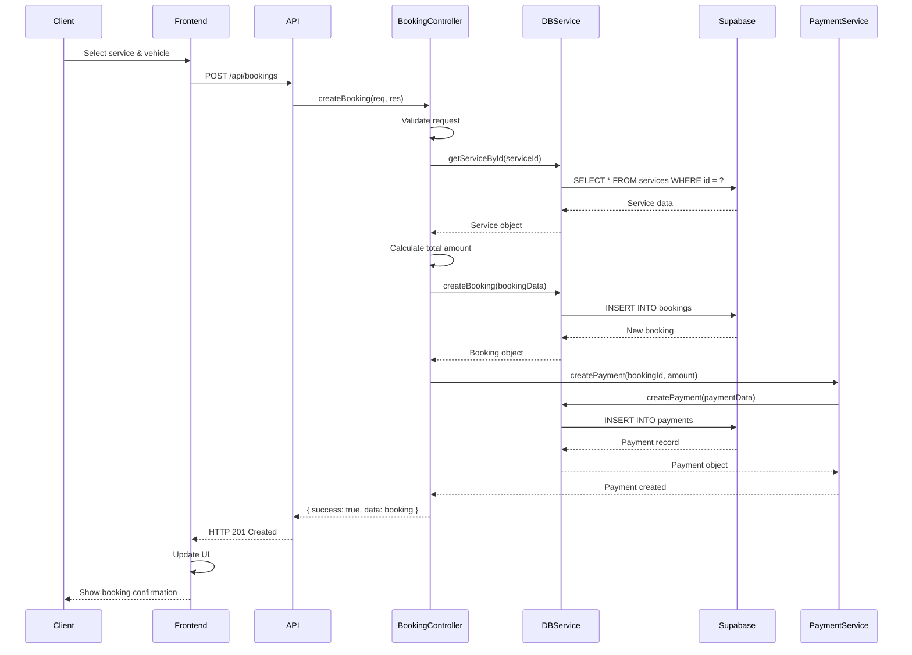
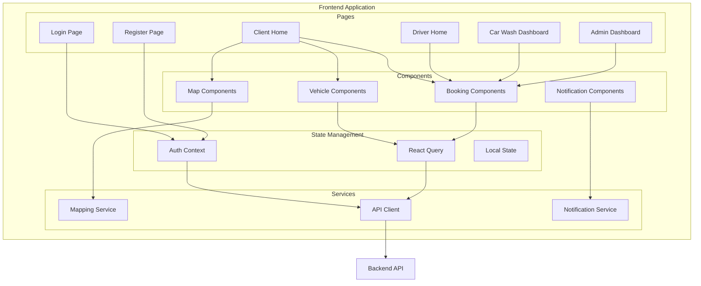

# SuCAR - Car Wash Pickup Booking System

A comprehensive cross-platform car wash booking system that connects clients, drivers, car wash operators, and administrators.

## System Overview

SuCAR (SuKA) is a full-stack application designed to automate car wash bookings and pickups, reducing client waiting time and improving service efficiency.

## Features

### Client Features
- Register/Login
- Book car wash pickup
- Select preferred driver and car wash
- Track booking status in real-time
- Manage vehicles
- View booking history

### Driver Features
- Register/Login
- Accept/decline booking requests
- Update booking status (Picked Up → Delivered)
- View assigned bookings
- Track performance

### Car Wash Features
- Register/Login
- Manage services and pricing
- Update vehicle status (Waiting Bay → Washing Bay → Drying Bay → Done)
- View incoming bookings
- Monitor revenue

### Admin Features
- Dashboard with statistics
- Manage drivers
- Manage bookings
- Assign drivers to bookings
- View reports and analytics
- Payment tracking

## Technology Stack

### Backend
- **Node.js** with **Express**
- **TypeScript**
- **Supabase** (PostgreSQL) for database
- **JWT** for authentication
- **bcryptjs** for password hashing
- **Mapbox** for location services
- **Twilio** for SMS/OTP (optional)
- **Google OAuth** for social login

### Frontend (Web Dashboard)
- **React** with **TypeScript**
- **Vite** for build tooling
- **React Router** for navigation
- **React Query** for data fetching
- **Recharts** for analytics

### Mobile App
- **React Native** with **Expo**
- **TypeScript**
- **React Navigation**
- **Axios** for API calls
- **AsyncStorage** for local storage

## Project Structure

```
Sucar/
├── backend/          # Node.js/Express API
│   ├── src/
│   │   ├── models/      # TypeScript models
│   │   ├── controllers/ # Route controllers
│   │   ├── routes/      # API routes
│   │   ├── middleware/  # Auth middleware
│   │   └── config/      # Database config
│   └── package.json
├── frontend/        # React web dashboard
│   ├── src/
│   │   ├── components/  # React components
│   │   ├── pages/       # Page components
│   │   └── context/     # Auth context
│   └── package.json
└── mobile/         # React Native app
    ├── src/
    │   ├── screens/     # Screen components
    │   └── context/     # Auth context
    └── package.json
```

## Setup Instructions

### Prerequisites
- Node.js (v18 or higher)
- Supabase (local via Docker or cloud instance)
- Docker Desktop (for local Supabase)
- npm or yarn

### Backend Setup

1. Navigate to backend directory:
```bash
cd backend
```

2. Install dependencies:
```bash
npm install
```

3. Create `.env` file:
```env
PORT=5000
SUPABASE_URL=http://localhost:54325
SUPABASE_ANON_KEY=your_supabase_anon_key
SUPABASE_SERVICE_ROLE_KEY=your_service_role_key
JWT_SECRET=your-super-secret-jwt-key-change-in-production
JWT_EXPIRE=7d
NODE_ENV=development
```

**Note**: For local development, start Supabase first:
```bash
# From project root
.\start-supabase.ps1
# Or manually: supabase start
```

4. Start the server:
```bash
npm run dev
```

The backend will run on `http://localhost:5000`

### Frontend Setup (Web Dashboard)

1. Navigate to frontend directory:
```bash
cd frontend
```

2. Install dependencies:
```bash
npm install
```

3. Create `.env` file (optional):
```env
VITE_API_URL=http://localhost:5000/api
```

4. Start the development server:
```bash
npm run dev
```

The frontend will run on `http://localhost:3000`

### Mobile App Setup

1. Navigate to mobile directory:
```bash
cd mobile
```

2. Install dependencies:
```bash
npm install
```

3. Update API URL in `src/context/AuthContext.tsx`:
```typescript
const API_URL = 'http://YOUR_IP_ADDRESS:5000/api'; // Use your computer's IP for emulator/device
```

4. Start Expo:
```bash
npm start
```

5. For iOS Simulator:
```bash
npm run ios
```

6. For Android Emulator:
```bash
npm run android
```

## Testing with Emulators

### iOS Simulator (macOS only)
1. Install Xcode from App Store
2. Open Xcode and install iOS Simulator
3. Run `npm run ios` in the mobile directory

### Android Emulator
1. Install Android Studio
2. Set up Android Virtual Device (AVD)
3. Start the emulator from Android Studio
4. Run `npm run android` in the mobile directory

### Web Testing
- Frontend dashboard: `http://localhost:3000`
- Backend API: `http://localhost:5000/api`

## API Endpoints

### Authentication
- `POST /api/auth/register` - Register new user
- `POST /api/auth/login` - Login user
- `GET /api/auth/me` - Get current user

### Bookings
- `GET /api/bookings` - Get all bookings (filtered by role)
- `POST /api/bookings` - Create new booking
- `GET /api/bookings/:id` - Get booking details
- `PUT /api/bookings/:id/status` - Update booking status
- `PUT /api/bookings/:id/cancel` - Cancel booking

### Drivers
- `GET /api/drivers/available` - Get available drivers
- `GET /api/drivers/bookings` - Get driver bookings
- `PUT /api/drivers/bookings/:id/accept` - Accept booking
- `PUT /api/drivers/bookings/:id/decline` - Decline booking

### Car Wash
- `GET /api/carwash/list` - Get all car washes
- `GET /api/carwash/services` - Get services
- `GET /api/carwash/bookings` - Get car wash bookings
- `GET /api/carwash/dashboard` - Get dashboard stats
- `POST /api/carwash/services` - Create service
- `PUT /api/carwash/services/:id` - Update service

### Admin
- `GET /api/admin/dashboard` - Get admin dashboard
- `GET /api/admin/users` - Get all users
- `PUT /api/admin/users/:id` - Update user
- `GET /api/admin/bookings` - Get all bookings
- `PUT /api/admin/bookings/:id/assign-driver` - Assign driver
- `GET /api/admin/reports` - Get reports

### Vehicles
- `GET /api/vehicles` - Get user vehicles
- `POST /api/vehicles` - Add vehicle
- `PUT /api/vehicles/:id` - Update vehicle
- `DELETE /api/vehicles/:id` - Delete vehicle

### Payments
- `POST /api/payments/initiate` - Initiate payment
- `GET /api/payments/booking/:bookingId` - Get payment by booking

## User Roles

1. **Client**: Can book car washes, manage vehicles, track bookings
2. **Driver**: Can accept bookings, update pickup/delivery status
3. **Car Wash**: Can manage services, update wash status
4. **Admin**: Full system access, manage all entities

## Database Schema

- **Users**: Clients, Drivers, Car Washes, Admins
- **Vehicles**: Client vehicle information
- **Bookings**: Booking records with status tracking
- **Services**: Car wash services and pricing
- **Payments**: Payment records

## Entity Relationship (ER) Diagram



## How the System Works - Detailed Workflow

### System Overview and Booking Flow

SuCAR operates as a real-time coordination platform connecting four main stakeholders: **Clients**, **Drivers**, **Car Washes**, and **Admins**. The system supports two primary booking workflows:

#### 1. Pickup & Delivery Workflow
This workflow is designed for clients who want the car picked up from their location, washed, and delivered back.

**Flow:**
1. **Client Books Service**
   - Client selects a car, service type, and preferred pickup time
   - Client provides pickup location (address or GPS coordinates)
   - System calculates total cost and creates a booking in `pending` status
   - Client pays upfront (or on pickup, depending on configuration)

2. **System Assigns Driver**
   - Backend automatically finds available drivers near the pickup location
   - Sends booking notification to eligible drivers
   - Admin can manually assign if automatic assignment fails

3. **Driver Accepts and Picks Up**
   - Driver receives notification, views booking details (client info, vehicle, location)
   - Driver navigates to pickup location using integrated Mapbox
   - Booking status changes to `accepted` → `picked_up`
   - Driver confirms pickup through app (with optional photo)

4. **Driver Takes Vehicle to Car Wash**
   - Driver drives to selected car wash location
   - Booking status changes to `at_wash`
   - Driver informs car wash about arrival

5. **Car Wash Processes Vehicle**
   - Car wash staff receives vehicle with booking details
   - Vehicle moves through queue: `waiting_bay` → `washing_bay` → `drying_bay`
   - Car wash updates status in real-time through dashboard
   - System notifies driver of progress

6. **Driver Delivers Vehicle**
   - Once wash completes (`wash_completed`), driver receives notification
   - Driver picks up vehicle and navigates back to client's location
   - Status updates to `delivered` as driver returns vehicle
   - Client receives notification that vehicle is en route

7. **Completion**
   - Driver confirms delivery at client location
   - Status changes to `completed`
   - Payment processing completes
   - Both driver and car wash receive payment confirmation

#### 2. Drive-In Workflow
This workflow is for clients who drive their own car to the car wash facility and wait for service.

**Flow:**
1. **Client Books Service**
   - Client selects car, service, and preferred time window
   - Booking created in `pending` status
   - No driver required for this type

2. **Client Arrives at Car Wash**
   - Client drives to car wash location
   - Client confirms arrival through app
   - Status changes to `at_wash`
   - System adds vehicle to visible queue

3. **Queue Management**
   - Vehicle assigned a `queue_position`
   - System calculates `estimated_wait_time` based on:
     - Current queue length
     - Average service duration
     - Number of available bays
   - Client can see real-time queue position and estimated wait

4. **Service Execution**
   - Vehicle moves through stations: `waiting_bay` → `washing_bay` → `drying_bay`
   - Car wash updates status for each transition
   - Client sees real-time progress on dashboard
   - Estimated wait time updates as vehicles ahead complete

5. **Service Completion**
   - Once `wash_completed`, car wash notifies client
   - Client collects vehicle
   - Status changes to `completed`
   - Payment processed immediately

### Key System Features and Interactions

#### Queue Management
- **Automatic Queue Assignment**: Drive-in bookings automatically join queue with position based on arrival time
- **Queue Position Updates**: Real-time updates as vehicles move through wash process
- **Estimated Wait Time Calculation**: Dynamic calculation based on vehicle count and bay availability
- **Priority Handling**: Admin can adjust queue positions for VIP or delayed services

#### Real-Time Status Updates
- **Polling-Based Updates**: Frontend polls backend every 3 seconds for status changes
- **Status Transitions**: Bookings follow strict workflow:
  - `pending` → `accepted` (driver accepts or admin assigns)
  - `accepted` → `picked_up` (for pickup_delivery only)
  - `picked_up` → `at_wash`
  - `at_wash` → `waiting_bay`
  - `waiting_bay` → `washing_bay`
  - `washing_bay` → `drying_bay`
  - `drying_bay` → `wash_completed`
  - `wash_completed` → `delivered` (pickup_delivery) or `completed` (drive_in)
  - `delivered` → `completed`

#### Role-Based Access Control (RBAC)
- **JWT Authentication**: All API endpoints protected with JWT tokens
- **Row Level Security (RLS)**: Supabase enforces database-level access policies
- **Middleware Authorization**: Express middleware validates role permissions
- **Database Policies**: Users only see data relevant to their role

**Role Permissions:**
- **Client**: Can only view/manage own bookings and vehicles
- **Driver**: Can view assigned bookings, update own status, view earnings
- **Car Wash**: Can view bookings at their location, update queue/wash status
- **Admin**: Full system access to all bookings, users, payments, and reports

#### Payment Processing
- **Service Charge**: Total cost = service price + any applicable fees
- **Payment Methods**: Cash, Card, Mobile Money, Bank Transfer (extensible)
- **Refund Handling**: Automatic refunds for cancelled bookings
- **Payment Status Tracking**: `pending` → `completed` or `failed` → `refunded`
- **Audit Trail**: All transactions logged for reporting

#### Location Services (Mapbox Integration)
- **Driver Geolocation**: Continuously tracks driver location for ETA
- **Pickup Point Mapping**: Displays client's exact pickup address
- **Route Optimization**: Calculates optimal routes between pickup, car wash, and delivery
- **Distance Calculation**: Estimates driver travel time for accurate ETAs

#### Communication Features
- **Booking Notifications**: SMS/Push for status changes
- **Real-Time Chat**: Direct messaging between client, driver, and car wash
- **Status Updates**: Automatic notifications at each workflow stage
- **Emergency Contact**: Direct phone/messaging if issues arise

---

## UML Diagrams

### Use Case Diagram - Complete System Interactions

```mermaid
graph TB
    subgraph Actors["Actors"]
        C["👤 Client"]
        D["👤 Driver"]
        W["👤 Car Wash"]
        A["👤 Admin"]
        S["⚙️ System"]
    end
    
    subgraph ClientUC["Client Use Cases"]
        UC1["Register/Login"]
        UC2["Manage Profile"]
        UC3["Add Vehicles"]
        UC4["Book Service<br/>Pickup & Delivery"]
        UC5["Book Service<br/>Drive-In"]
        UC6["View Booking<br/>Details"]
        UC7["Track Real-Time<br/>Status"]
        UC8["View Queue<br/>Position"]
        UC9["Communicate<br/>via Chat"]
        UC10["Make Payment"]
        UC11["Rate Service"]
        UC12["View Booking<br/>History"]
    end
    
    subgraph DriverUC["Driver Use Cases"]
        UC13["Register/Login"]
        UC14["View Available<br/>Bookings"]
        UC15["Accept/Decline<br/>Booking"]
        UC16["Update Pickup<br/>Status"]
        UC17["Update Delivery<br/>Status"]
        UC18["Navigate to<br/>Locations"]
        UC19["Communicate<br/>via Chat"]
        UC20["View Earnings"]
        UC21["Track<br/>Performance"]
    end
    
    subgraph CarWashUC["Car Wash Use Cases"]
        UC22["Register/Login"]
        UC23["Manage Services<br/>& Pricing"]
        UC24["View Incoming<br/>Bookings"]
        UC25["Manage Queue<br/>Position"]
        UC26["Update Wash<br/>Status"]
        UC27["Track Vehicle<br/>Progress"]
        UC28["Communicate<br/>via Chat"]
        UC29["View Dashboard<br/>& Stats"]
        UC30["Monitor<br/>Revenue"]
        UC31["Export Reports"]
    end
    
    subgraph AdminUC["Admin Use Cases"]
        UC32["Login"]
        UC33["Manage Users"]
        UC34["View All<br/>Bookings"]
        UC35["Assign Drivers<br/>Manually"]
        UC36["Adjust Queue<br/>Positions"]
        UC37["View System<br/>Analytics"]
        UC38["Generate<br/>Reports"]
        UC39["Handle<br/>Disputes"]
        UC40["Manage<br/>Payments"]
        UC41["Configure<br/>System Settings"]
    end
    
    subgraph SystemUC["System Use Cases"]
        UC42["Authenticate User"]
        UC43["Validate Input"]
        UC44["Calculate Costs"]
        UC45["Auto-Assign<br/>Drivers"]
        UC46["Generate<br/>Notifications"]
        UC47["Update Queue"]
        UC48["Process Payment"]
        UC49["Log Events"]
        UC50["Optimize Routes"]
    end
    
    C -->|"interact with"| UC1
    C -->|"manage"| UC2
    C -->|"maintain"| UC3
    C -->|"create"| UC4
    C -->|"create"| UC5
    C -->|"view"| UC6
    C -->|"monitor"| UC7
    C -->|"check"| UC8
    C -->|"use"| UC9
    C -->|"pay via"| UC10
    C -->|"submit"| UC11
    C -->|"review"| UC12
    
    D -->|"interact with"| UC13
    D -->|"browse"| UC14
    D -->|"action"| UC15
    D -->|"update"| UC16
    D -->|"update"| UC17
    D -->|"use"| UC18
    D -->|"use"| UC19
    D -->|"review"| UC20
    D -->|"monitor"| UC21
    
    W -->|"interact with"| UC22
    W -->|"configure"| UC23
    W -->|"view"| UC24
    W -->|"manage"| UC25
    W -->|"update"| UC26
    W -->|"monitor"| UC27
    W -->|"use"| UC28
    W -->|"view"| UC29
    W -->|"review"| UC30
    W -->|"export"| UC31
    
    A -->|"interact with"| UC32
    A -->|"administer"| UC33
    A -->|"oversee"| UC34
    A -->|"allocate"| UC35
    A -->|"optimize"| UC36
    A -->|"review"| UC37
    A -->|"generate"| UC38
    A -->|"resolve"| UC39
    A -->|"oversee"| UC40
    A -->|"configure"| UC41
    
    S -->|"supports"| UC42
    S -->|"enforces"| UC43
    S -->|"executes"| UC44
    S -->|"performs"| UC45
    S -->|"triggers"| UC46
    S -->|"maintains"| UC47
    S -->|"handles"| UC48
    S -->|"tracks"| UC49
    S -->|"calculates"| UC50
    
    UC4 -.->|"<<include>>"| UC42
    UC5 -.->|"<<include>>"| UC42
    UC4 -.->|"<<include>>"| UC45
    UC5 -.->|"<<include>>"| UC47
    UC10 -.->|"<<include>>"| UC48
    UC1 -.->|"<<include>>"| UC42
    UC13 -.->|"<<include>>"| UC42
    UC22 -.->|"<<include>>"| UC42
    UC32 -.->|"<<include>>"| UC42
    
    style Actors fill:#e1f5ff
    style ClientUC fill:#c8e6c9
    style DriverUC fill:#ffe0b2
    style CarWashUC fill:#f8bbd0
    style AdminUC fill:#e1bee7
    style SystemUC fill:#d1c4e9
```



**Diagram Explanation:** The Use Case Diagram illustrates all interactions within the SuCAR ecosystem. Five actor groups perform distinct roles:

- **Client (Green)**: Initiates bookings, manages vehicles, tracks progress, and makes payments. Clients can choose between pickup & delivery or drive-in services.
- **Driver (Orange)**: Accepts available bookings and manages pickup/delivery operations with real-time location updates via Mapbox.
- **Car Wash (Pink)**: Manages service offerings, processes vehicles through queue stages, and monitors operational metrics.
- **Admin (Purple)**: Oversees entire platform operations including user management, booking assignments, queue optimization, and dispute resolution.
- **System (Blue)**: Provides core infrastructure including authentication, payment processing, queue management, and real-time notifications.

Key relationships show:
- **Include relationships** (dotted lines): Operations that depend on other operations (e.g., all bookings include authentication)
- **Actor interactions**: How each role participates in the system's workflow
- **Dependency flow**: Authentication supports all user actions; payments support all transactions; queue management supports drive-in bookings

This diagram ensures all stakeholders understand their responsibilities and how they interact within the platform.

---

### System Architecture Diagram



**Diagram Explanation:** The System Architecture Diagram displays how SuCAR's components interact across multiple layers:

- **Client Layer (Top)**: Web Dashboard (React) and Mobile App (React Native/Expo) serve as user interfaces, supporting all four roles accessing the system from different devices.

- **API Gateway (Center)**: Express.js REST API acts as the single entry point, handling all client requests with JWT authentication and routing them to appropriate services.

- **Business Logic Layer**: Five core services handle specific domains:
  - **Authentication Service**: Manages JWT tokens, OAuth (Google), OTP verification, and session management
  - **Booking Service**: Orchestrates entire booking lifecycle, handles both pickup & delivery and drive-in workflows
  - **Payment Service**: Processes payments via multiple methods (cash, card, mobile money), handles refunds and payment status tracking
  - **Location Service**: Integrates with Mapbox for geolocation, route optimization, and distance calculations
  - **Notification Service**: Sends SMS via Twilio, push notifications, and in-app chat messages

- **Data Layer**: Supabase PostgreSQL provides persistent storage with Row Level Security (RLS) policies enforcing role-based access. Redis Cache optimizes frequently accessed booking and queue data.

- **External Services**: Mapbox (location/routing), Twilio (SMS communications), Google OAuth (social login) extend platform capabilities.

This architecture ensures scalability, security, and real-time responsiveness across all operations.

---



**Diagram Explanation:** The Class Diagram represents the backend's core TypeScript classes and their relationships:

- **DBService Class**: Central data access layer providing static methods for all database operations. It handles case-insensitive email lookups to prevent "user not found" errors, password comparison using bcrypt, and converts between snake_case (database) and camelCase (application) formats.

- **AuthController Class**: Manages authentication workflows including registration, login, profile updates, Google OAuth, and OTP verification. All methods return standardized JSON responses with success/error flags.

- **BookingController Class**: Handles complete booking lifecycle - retrieval, creation, status updates, and cancellations. Enforces role-based authorization to ensure users only access their relevant bookings.

- **Entity Classes**:
  - **User**: Represents all roles (client, driver, car_wash, admin) with role-specific fields
  - **Booking**: Core entity tracking booking progression through status stages, payment status, timeline, queue position
  - **Vehicle**: Belongs to clients, defines car properties for booking association
  - **Service**: Defined by car washes, contains pricing information

- **Relationships**:
  - Controllers delegate to DBService (dependency injection pattern)
  - DBService manages all entities (CRUD operations)
  - Bookings reference Users (client, driver, car wash owner) and Vehicles
  - Bookings include Services with pricing data
  - Vehicles belong to Clients

This structure enforces separation of concerns and makes the codebase maintainable and testable.

---



**Diagram Explanation:** The User Login Flow demonstrates how authentication is secured and managed:

1. **Client Initiation**: User enters credentials (email, password) on the frontend login page.

2. **Request Transmission**: Frontend sends POST request to `/api/auth/login` with email and password payload.

3. **Backend Validation**: AuthController validates input (checks for missing fields, format compliance) before querying the database.

4. **Database Lookup**: DBService queries Supabase for the user using case-insensitive email matching to prevent lookup failures. This is critical for user experience.

5. **Password Verification**: DBService compares the plain-text password against the bcrypt hash stored in the database. This happens asynchronously to prevent timing attacks.

6. **Token Generation**: Upon successful verification, the JWT service generates a token containing:
   - User ID (payload)
   - User role (for RBAC)
   - Expiration time (default 7 days)
   - Secret key signature (for token integrity)

7. **Response Chain**: AuthController returns success response with user data and JWT token. API forwards this to frontend.

8. **Client-Side Storage**: Frontend stores JWT in localStorage (accessible for all API requests) and navigates user to appropriate dashboard based on role.

9. **Session Management**: On subsequent requests, the JWT token is automatically included in the `Authorization: Bearer <token>` header for all API calls, enabling stateless authentication.

This flow ensures secure credential handling, prevents session hijacking, and provides role-based access control from the login point onward.

---

### Sequence Diagram - Booking Creation Flow



**Diagram Explanation:** The Booking Creation Flow illustrates how the system orchestrates service reservations from client request to payment processing:

1. **User Selection**: Client selects desired service (car wash type, pricing) and vehicle from their registered inventory.

2. **API Request**: Frontend sends POST to `/api/bookings` with service ID, vehicle ID, booking type (pickup_delivery or drive_in), and pickup location/time.

3. **Request Validation**: BookingController validates all required fields, checks service availability, confirms vehicle ownership matches authenticated user.

4. **Service Retrieval**: DBService queries Supabase for complete service data including pricing, car wash location, and availability.

5. **Cost Calculation**: BookingController calculates total amount: base service price + any applicable fees or taxes.

6. **Booking Creation**: DBService inserts new booking record into Supabase with:
   - Status set to `pending`
   - Queue position (for drive-in) or `null` (for pickup_delivery)
   - Scheduled timestamps
   - Payment status as `pending`

7. **Payment Processing**: PaymentService creates corresponding payment record in the database with:
   - Amount from booking calculation
   - Payment method (to be filled by client)
   - Status initially `pending`

8. **Response Chain**: System returns newly created booking with all details and unique booking ID.

9. **Frontend Confirmation**: Frontend displays booking confirmation with:
   - Booking ID (for reference)
   - Service details and cost breakdown
   - Expected timeline for pickup/drive-in
   - Next steps for payment and service

10. **Driver Assignment**: Backend asynchronously searches for available drivers (for pickup_delivery type) or adds vehicle to queue (for drive_in type).

This flow ensures data integrity, prevents double-booking, and establishes clear audit trail for bookings and payments.

---

### Entity Relationship Diagram



**Diagram Explanation:** The Frontend Component Architecture shows how React components organize around data flow and state management:

- **Page Components (Top)**: 
  - **Login/Register Pages**: Entry points for all users, authenticate via AuthContext
  - **Role-Specific Dashboards**: Client Home (booking management), Driver Home (assignment tracking), Car Wash Dashboard (queue management), Admin Dashboard (system oversight)

- **Component Layer (Middle)**:
  - **Booking Components**: Unified BookingCard for displaying bookings across all roles with context-aware rendering (shows different actions for client vs driver vs car wash)
  - **Vehicle Components**: Forms for adding/editing vehicles, vehicle selection in booking flow
  - **Map Components**: Mapbox integration for pickup location selection and live driver tracking
  - **Notification Components**: Toast alerts, modal confirmations, real-time status notifications

- **State Management (Lower-Middle)**:
  - **Auth Context**: Manages JWT tokens, current user data, role information, login/logout operations
  - **React Query**: Handles async data fetching, caching, and background synchronization for bookings, users, payments
  - **Local State**: Component-level state for UI interactions (form inputs, modal visibility, dropdowns)

- **Service Layer (Bottom)**:
  - **API Client**: Axios instance with automatic JWT header injection, centralized error handling, base URL configuration
  - **Mapping Service**: Wraps Mapbox API calls for location search, geocoding, distance calculations
  - **Notification Service**: Abstracts toast notifications and modal dialogs

- **Backend Connection**: All services route through the API Client, which communicates with Express backend.

This architecture ensures:
- **Separation of Concerns**: Each layer handles specific responsibilities
- **Code Reusability**: Shared components reduce duplication across dashboards
- **Maintainability**: Single source of truth for each feature
- **Performance**: React Query optimizes data fetching and caching

---

### Component Diagram - Frontend Architecture

- JWT-based authentication
- Password hashing with bcrypt
- Role-based access control (RBAC)
- Input validation
- Protected API routes

## Future Enhancements

- GPS-based live vehicle tracking
- Push notifications
- Payment gateway integration
- Real-time updates with WebSockets
- AI-driven route optimization
- Business intelligence dashboards

## License

ISC

## Support

For issues and questions, please contact the development team.
